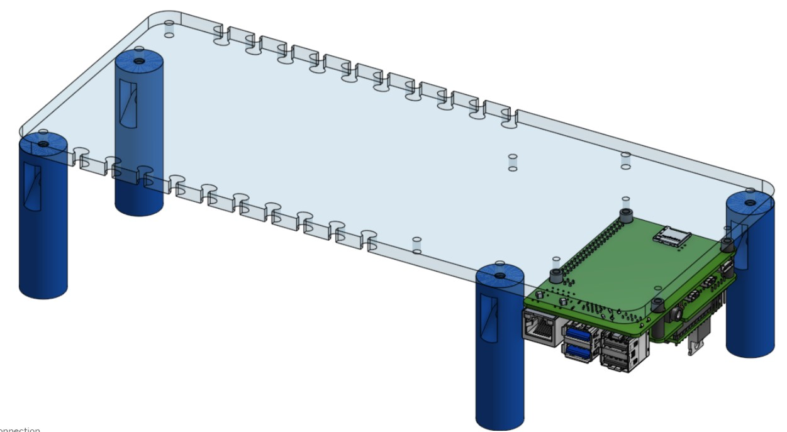
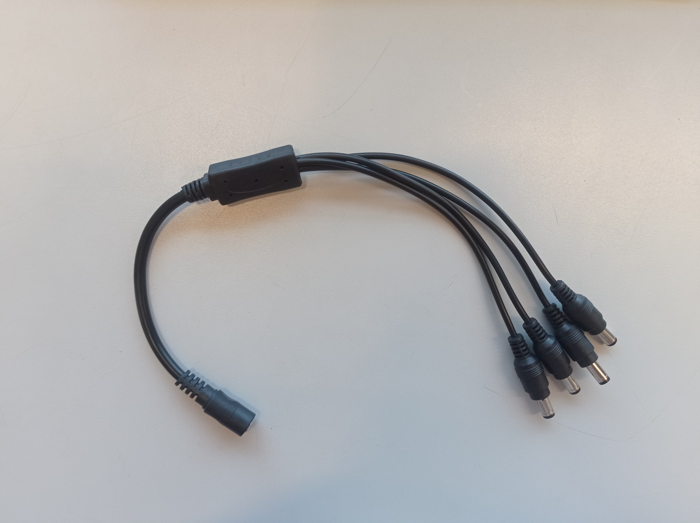
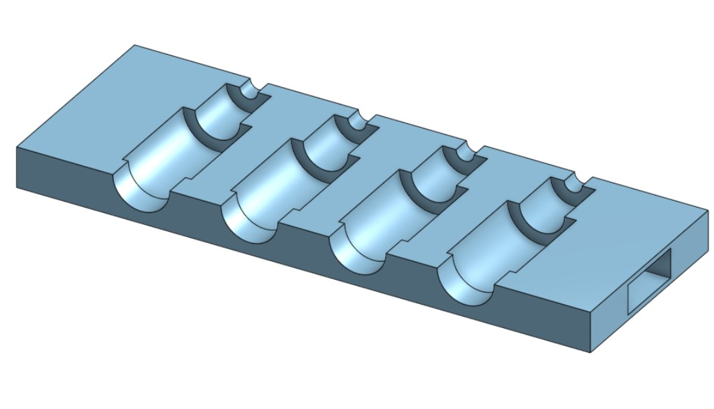
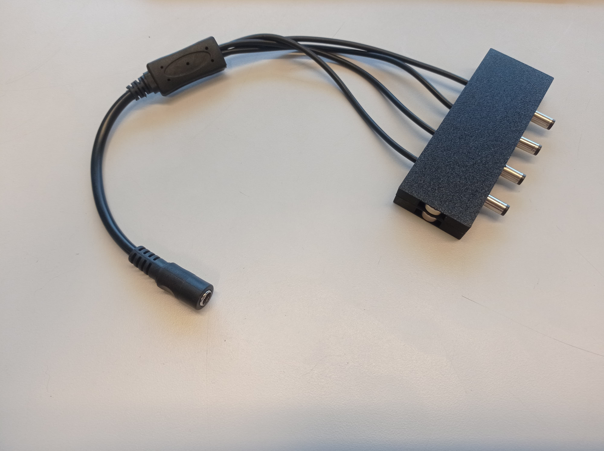

## Brain Module (Electronics)
 

This module consists of an acrylic five-millimeter plate that serves as the base for the [Heat and Stir Module](/Platform_Modules/Heat_Stir_Module/Readme.md) while also holding and protecting the main electronic component, the [Raspberry Pi](addlink_to_info_of_rasp) and the power supplies. As support, it uses previously designed seven centimeters stage legs screwed in with M3 screws and nuts.

### Module Plate
Imagen placa 

Complementary to this two different cable holders were designed to facilitate the organization of the cables coming out of the raspberry that can be grouped into two distinct types, the power adaptor and the Molex adaptor (in the name of the cable type). Both of these consist of two 3D printed parts that clamp the cables using four 1.1 centimeters round magnets

### Power Adaptor
With this adaptor, the majority of the cables can be tucked away under the optic table 

 

### Molex Adaptor
Imagen cable Imagen render Imagen IRL 

### Future Steps
- Define if the main plate needs to change to heat insert or maintain screws and nuts
- Design a way to keep the power supplies fixed under the main plate
- Improve on the adaptors to make the magnets not visible and less easy to remove
