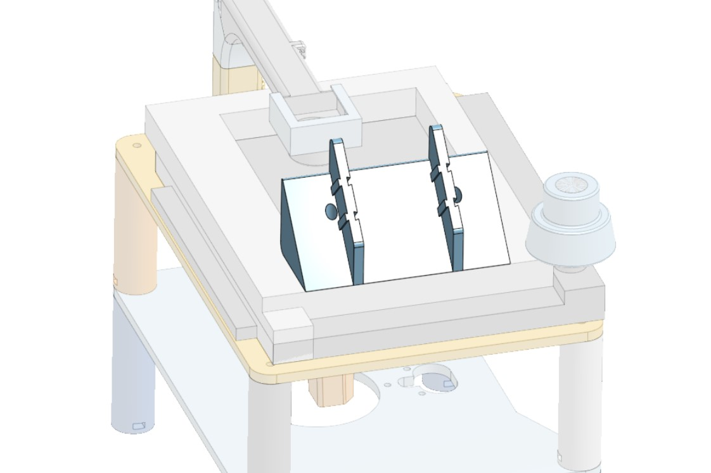

## Flow Sensor Module
 

This module consists of a 3D printed holder for the flow controllers whose objective is to keep the controllers still and close to the microchip of microfluidics allowing the tubings that run in between them to not be altered and as benefits shorten the time of travel from controller to chip.

The holder module is designed to be compatible with the flow controller casing previously designed to protect them. Working with a slide mechanism allows for easy handling of the flow controllers while maintaining a firm grip on them. this puts together is meant to be screwed into a metal [x-y movement system](link to stage module or web page of the system) using short M2 screws, this movement system is mounted to the microscopy stage to improve the observation of samples, more details [here]("Platform_Modules/Stage_Module/Readme.md")

 
 
 
 

### Future Steps
