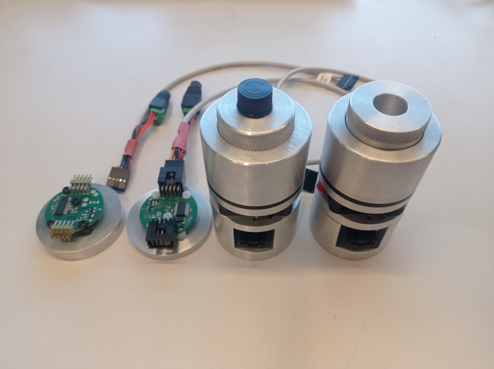
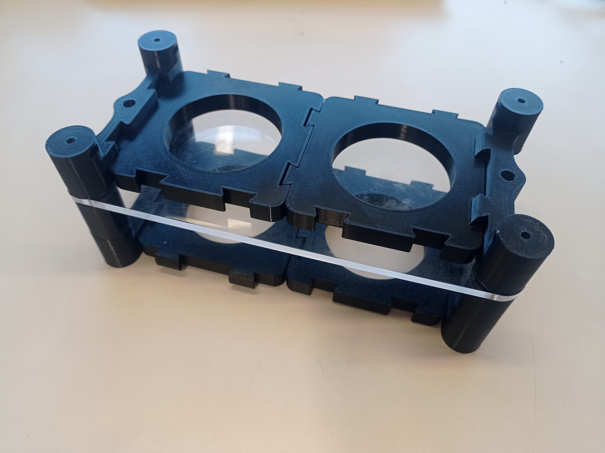
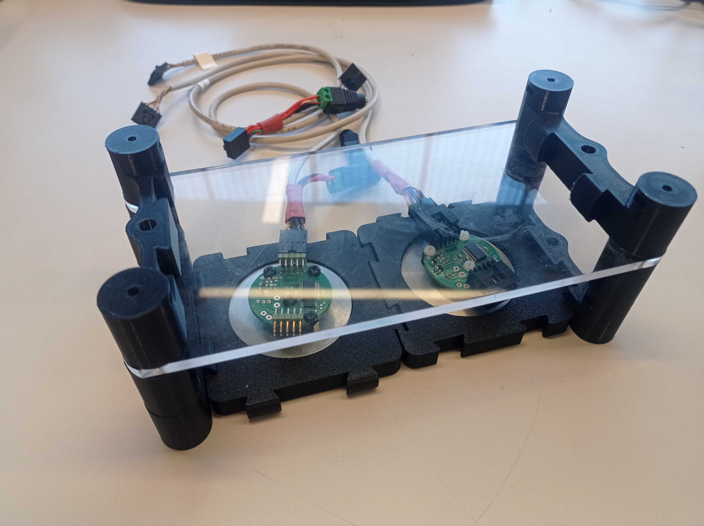

## Heat and Stear Module

For instance, the microfluid stage needs to be heated or the sample needs to be stared while kept warm, for this there is the need for 2 heaters and stirring components.

These components share the same base, a 5.5 cm diameter metal plate, for this a modular system that allows these 4 components to be enclosed together while minimizing space was implemented. This works with base pillars that have a design compatible with the [Modular Tube Holders](https://www.printables.com/model/514591-moldular-tube-holders) used by LibreHub, and that using the same stage legs from the microscopy stage allows for the assembling of multiple  floors  using an acrylic plate of 5 or 6 mm as support.

This module can be set up on top of the [Brain module](Platform_Modules/Brain_Module/Readme.md) connecting the stage legs or set up directly onto the optic table using the corresponding M4 screws

### Future Steps:
- The height of this stage could be modified so the second floor is on the same level as the microscopy stage
- Because the brain stage was designed later there is space on the surface of it that could be used by extending the bases of this module and allowing for extra tube holders
