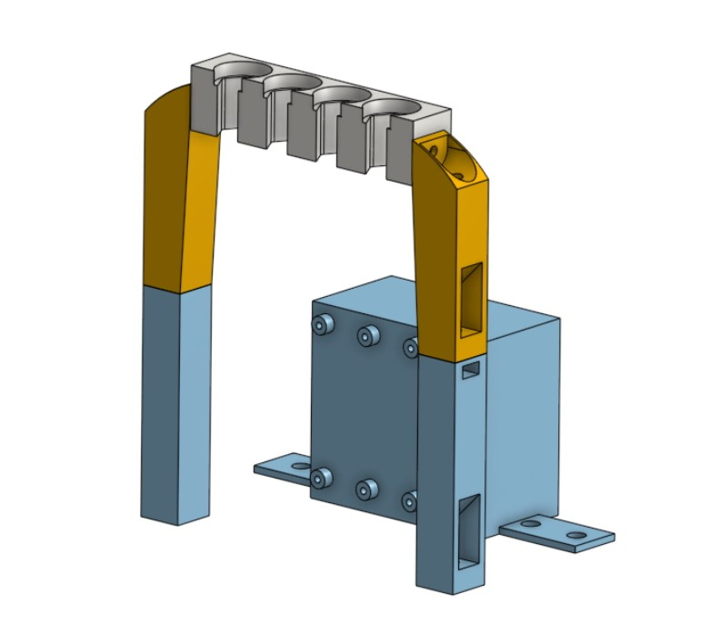
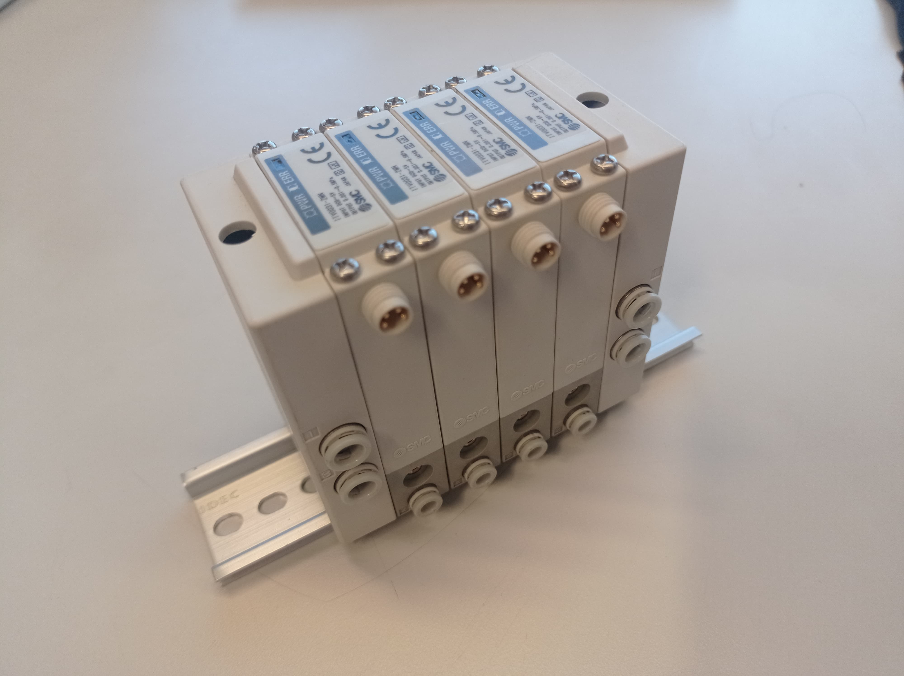
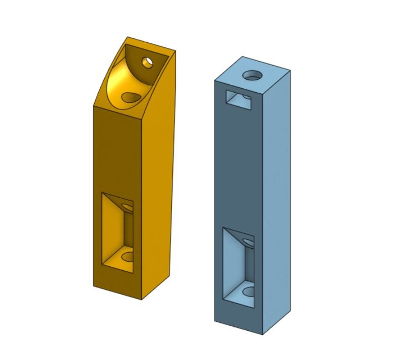
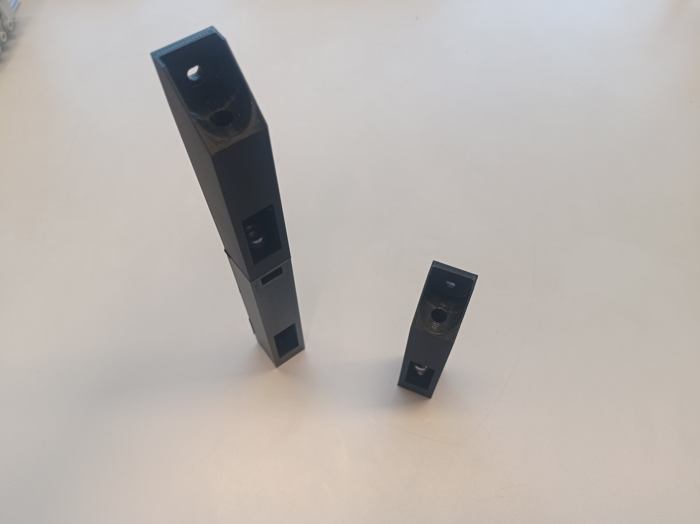
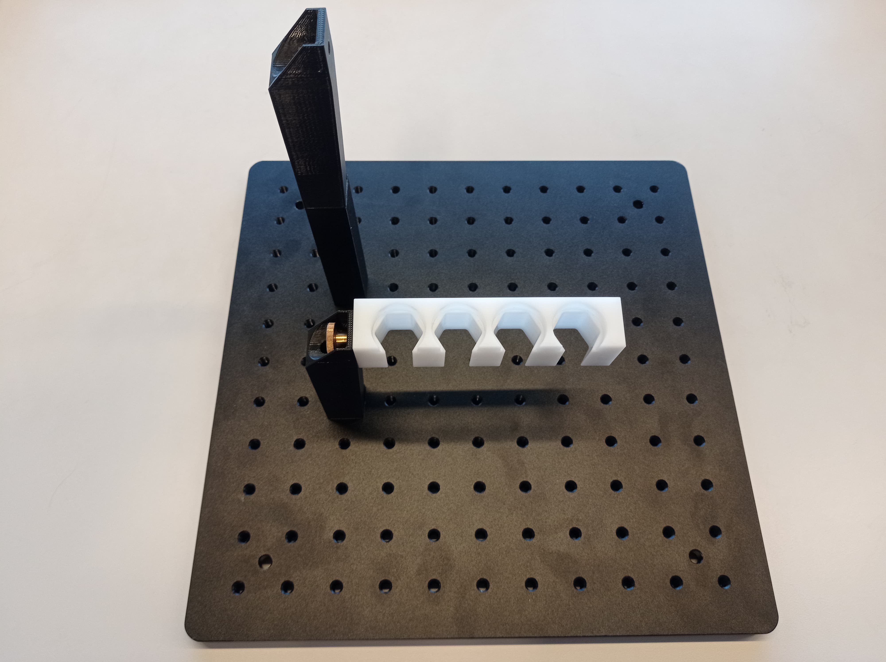

## Pressure Regulator Module

 

One of the crucial components when it comes to microfluidics experimentation is the correct management of the pressure of the fluids, for this a pressure regulator is needed

 

This regulator connects directly to the fluid samples that in the early unorganized state were held by the sample reservoir you can find [here](module_sample_reservoirs/Readme.md).

 

To accommodate the regulator and the samples in the newly organized setup the first step was allowing them to be closer to each other and reduce the need for unnecessary tubings between them. To prevent the reservoirs from crashing with the regulator new legs for de sample reservoir were designed allowing to modularly change of the height of the holder depending on the position of the regulator another component of the microscopy stage.

 
 
 

both the new legs and the regulator allow for a simple M6 screw to hold them onto the optic table but a screw and nut are needed for the extra levels of the legs

### Future Steps
- Is in discussion the need to use an external component to hold the vials and as a possibility using lacer cuts to hold the samples onto the plates of the microscope is a viable option
- The use of longer legs is determined by the height of the position of the flow controllers and is possible to need adjustments if the position of the flow controller changes
- The regulator is optimal to be closer to the samples but it's not completely necessary for both to be in the same vertical position and there is room to improve on changing the horizontal angle between these two components
