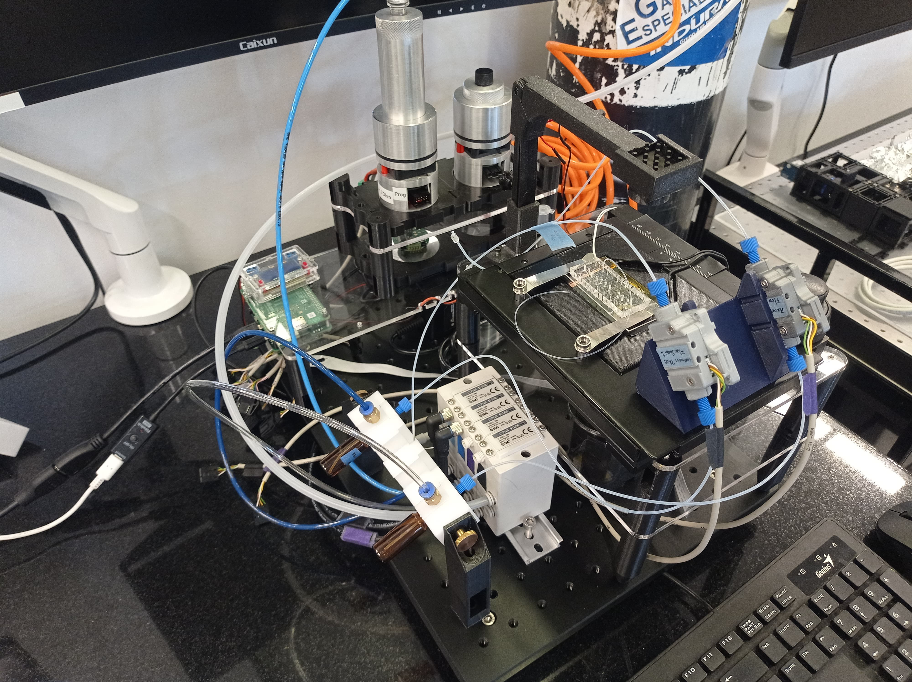
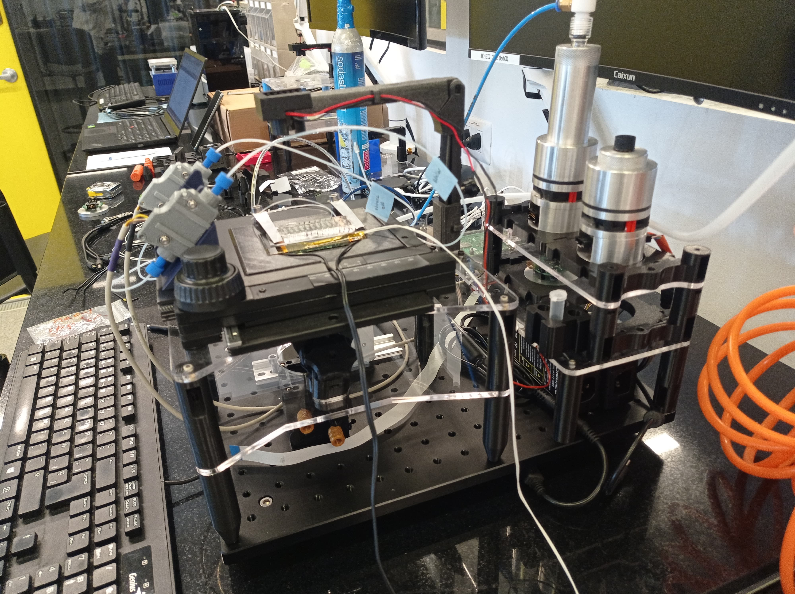
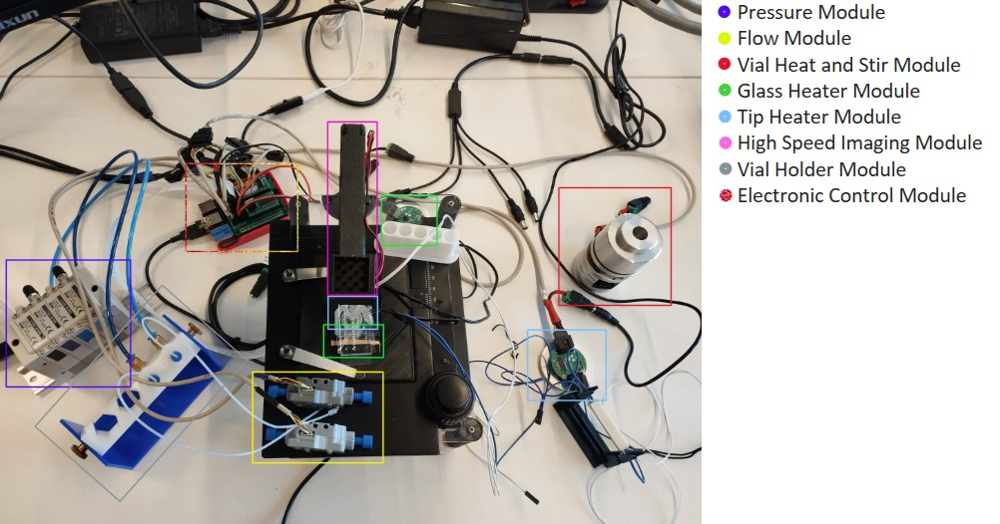
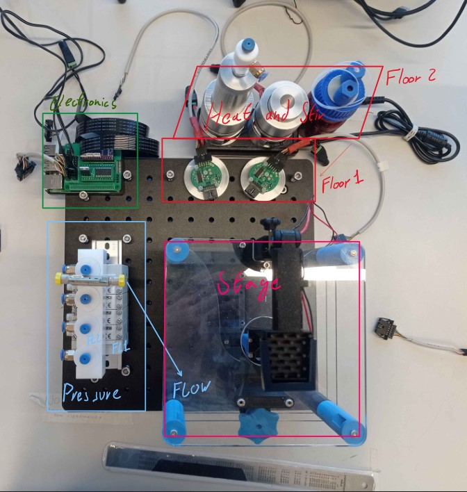

## Organization Modules 
Here you can find information about the different modules created to organize the flow microscopy platform, 3D files are all free accces on Onshape [here](https://cad.onshape.com/documents/959fee0bf6a5bfe78f1dda97/w/e657b641acef5b36bf9099ee/e/20e65f96ae81a38be57a4961)

 
 

From the analysis of the state of the microscopy platform without a clear method of organization eight crucial modules were identified:
- Pressure module
- Flow module
- Vial heat and stir module
- Glass heater module
- Tip heater module
- High-speed imaging module 
- Vial holder module 
- Electronic control module
  
 

In that state, all the modules were using an unreasonable amount of space in the science lab, therefore the objective of adapting them to an enclosed space and improving the organization and clustering of cables while maintaining the functionality of the system was established. To direct this process the established area was limited by an optic table with dimensions of 30 by 40 centimeters, which was purchased [here](https://es.aliexpress.com/item/1005005133684496.html?spm=a2g0o.order_list.order_list_main.145.b227194dLrgZ7B&gatewayAdapt=glo2esp). The reason to use this table is that it allows for an easier fixing of the elements to it do to the high weight and screwable surface.

 

From the eight initial modules we decide on reducing them to five by joining the modules that benefit for beeing closer together, resulting in this first iteration.

 

From further iteration on this model we got to the final optimal organization moduls that you can find with greater detail here:
- [Brain Module (Electronics)](Brain_Module/Readme.md)
- [Heat and Stir Module](Heat_Stir_Module/Readme.md)
- [Pressure Regulator Module](Pressure_Module/Readme.md)
- [Flow Sensor Module](Flow_Module/Readme.md)
- [Stage Module](Stage_Module/Readme.md) 
