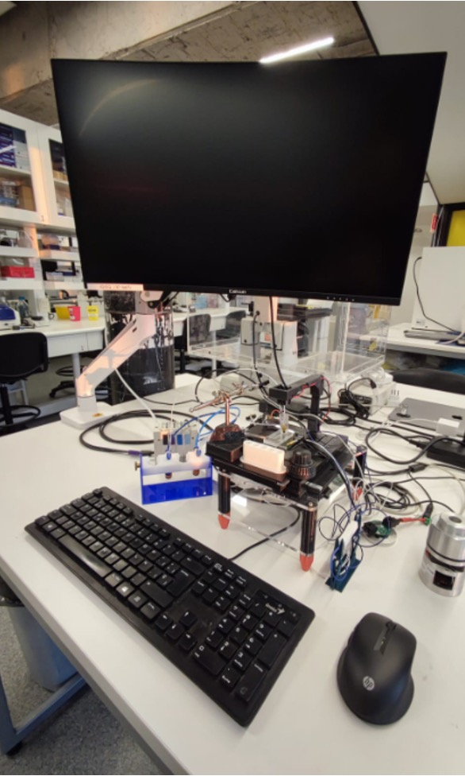

# Flow Microscopy Platform
Our open hardware flow microscopy platform is a more comprehensive version of our open-source [strobe-enhanced microscopy stage](https://github.com/wenzel-lab/strobe-enhanced-microscopy-stage) (build instructions [here](https://wenzel-lab.github.io/strobe-enhanced-microscopy-stage/)), including the control of pressure, flow and temperature in 4-channels. The platform is controlled by ["Rio", our modular microfluidics controller](https://github.com/wenzel-lab/modular-microfluidics-workstation-controller) boards and firmware. Working with pressurised gas, regulators, and flow sensors allows for a compact, faster, and more precise flow control compared to syringe pumps, such as our [3D printed syringe pumps with controller](https://github.com/wenzel-lab/syringe-pumps-and-controller). In contrast to other open-source platforms and some commercial platforms, our implementation is capable of handling high-pressures (up to 6 bar) in order to process gels and more viscous liquids.

Follow us! [#twitter](https://twitter.com/WenzelLab), [#YouTube](https://www.youtube.com/@librehub), [#LinkedIn](https://www.linkedin.com/company/92802424), [#instagram](https://www.instagram.com/wenzellab/), [#Printables](https://www.printables.com/@WenzelLab), [#LIBREhub website](https://librehub.github.io), [#IIBM website](https://ingenieriabiologicaymedica.uc.cl/en/people/faculty/821-tobias-wenzel)

## Usage

The platform consists of a number of different functional modules that are connected to each other:

We are currently arranging the modules with a cable management plan. Simply spreading the modules out on the table looked like this during previous experiments:

One use of our heater modules is the tip-heater for injecting agarose gel into microfluidic chips:

We also designed a pressure vial holder with individual manifold caps for easy transfer of samples:

## Contribute

You're free to fork the project and enhance it. If you have any suggestions to improve it or add any additional functions make a pull-request or [open an issue](https://github.com/wenzel-lab/flow-microscopy-platform/issues/new).
For interactions in our team and with the community applies the [GOSH Code of Conduct](https://openhardware.science/gosh-2017/gosh-code-of-conduct/).

## Team

+ Project initiators:
    - Tobias Wenzel @MakerTobey
    - Christie Nel @Cyberius
    - Pierre Padilla-Huamantinco @biodotpe
    - Matias Hurtado @matiashl27
+ Contributors:
    - Eduardo Honeyman

## License

[CERN OHL 2W](LICENSE) © Tobias Wenzel, Christie Nel, Eduardo Honeyman, Matías Hurtado, and Pierre Padilla-Huamantinco. This project is Open Source Hardware - please acknowledge us when using the hardware or sharing modifications.

## Funding

This work is part of funded projects granted to T.W. from ANID FONDECYT Iniciacion 11200666, the Chang Zuckerberg Initiative project ‘Latin American Hub for Bioimaging Through Open Hardware’, and CIFAR. Our team is also grateful for the additional funding and resources provided by the [Institute for Biological and Medical Engineering](https://ingenieriabiologicaymedica.uc.cl/en/).
