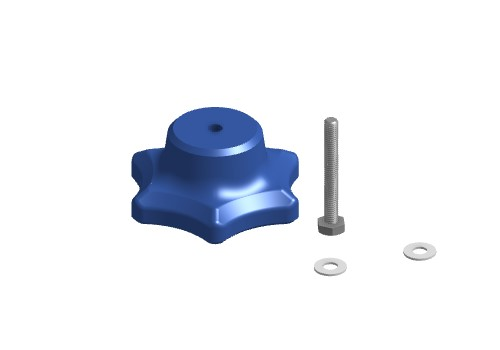
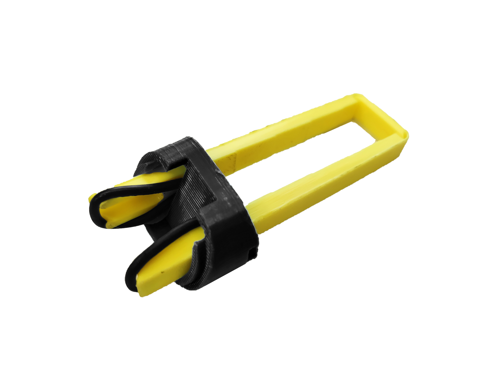

# Assemble the focus mechanism

### Consumables 

* 1 drop of [light oil]{: Class="bom"}    - Optional

### Mechanical Components 

* 1 [M3 nut]{: Class="bom"} 
* 2 [M3 washers]{: Class="bom"} 
* 1 [M3x25mm hex head screw]{: Class="bom"} 
* 1 [O-ring]{: Class="bom"} 

### 3D Printed Parts 

* 1 [Actuator Foot]{: Class="bom"} 
* 1 [Focusing assembly]{: Class="bom"} 
* 1 [Thumbwheel]{: Class="bom"} 

### 3D Printed Tools 

* 1 [Band tool]{: Class="bom"} 
* 1 [Nut tool]{: Class="bom"} 

[M3x25mm hex head screw]:parts/mech/HEX-M3-25.md ""
[M3 washers]:parts/mech/washer.md ""
[light oil]:parts/consumables/light-oil.md ""
[M3 nut]:parts/mech/nuts.md ""
[O-ring]:parts/mech/oring.md ""
[Nut tool]:models/actuator-assembly-tools.stl ""
[Band tool]:models/actuator-assembly-tools.stl ""
[Thumbwheel]:models/thumbwheel.stl ""
[Focusing assembly]:models/focusing-assembly.stl ""
[Actuator Foot]:models/z_foot.stl ""

## Step 1: Assemble the thumbwheel {:id="assemble-the-thumbwheel" class="page-step"}

* Push the [M3x25mm hex head screw] into the [thumbwheel][Thumbwheel].
* Thread the [M3 washers] onto the screw.
* Place a drop of [light oil] on the screw thread. You might want to put some kitchen paper or blu roll on your bench to soak up any dribbles of oil.

## Step 2: Insert the nut {:id="insert-the-nut" class="page-step"}

* Push the [M3 nut] into the slot in the [focusing assembly][Focusing assembly] (using the [nut insertion tool][Nut tool])

## Step 3: Add the thumbwheel {:id="add-the-thumbwheel" class="page-step"}

* Screw the [thumbwheel][Thumbwheel] assembly into the [M3 nut] in the [focusing assembly][Focusing assembly].

## Step 4: Insert the O ring {:id="insert-the-o-ring" class="page-step"}
* Next, we will insert the [O-ring] to complete the mechanism.

* Thread the [30mm diameter, 2mm thickness Viton O ring][O-ring] through the two holes in the [foot][Actuator Foot], and use the [band insertion tool][Band tool] to stretch the two loops of band as shown in the picture.

## Step 5: Click the band into place {:id="click-the-band-into-place" class="page-step"}

* Line the [foot][Actuator Foot] up with the hole in the bottom of the [focusing assembly][Focusing assembly], and push on the [band insertion tool][Band tool] to click the band into place.
* You should feel two clicks as the two ends of the band hook over the actuator column. It's easier if you use the [nut insertion tool][Nut tool] to hold the mechanism still as you do this.

## Step 6: Remove the tool {:id="remove-the-tool" class="page-step"}

* Gently pull the [band insertion tool][Band tool] out of the [foot][Actuator Foot].
* The band should pull the foot tight against the [focusing assembly][Focusing assembly] as shown.

Well done, you have now assembled the focusing mechanism.