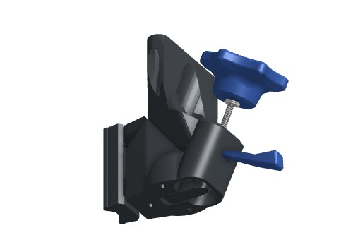
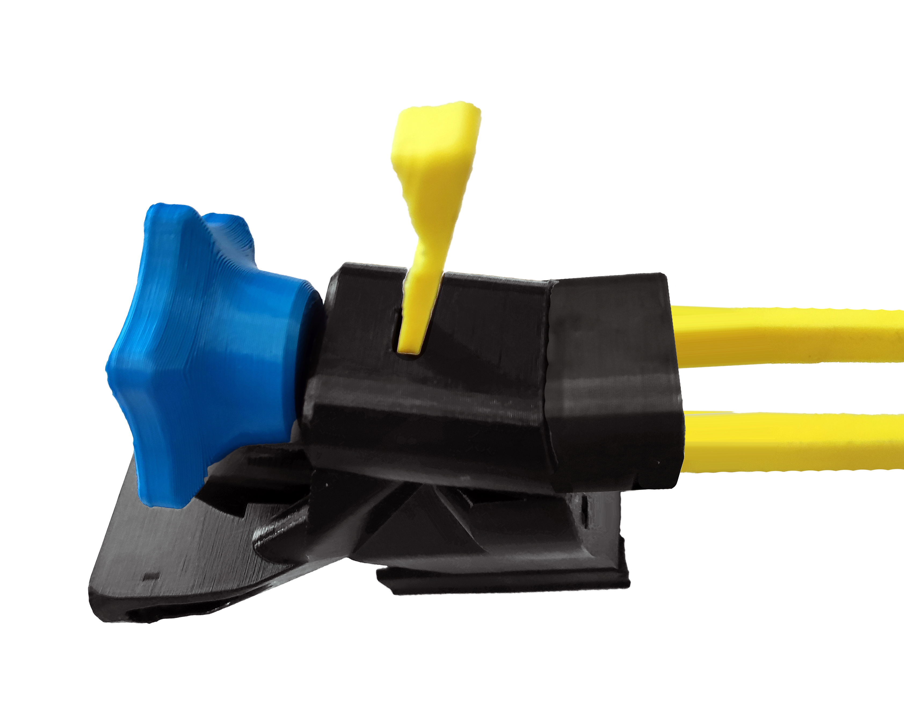
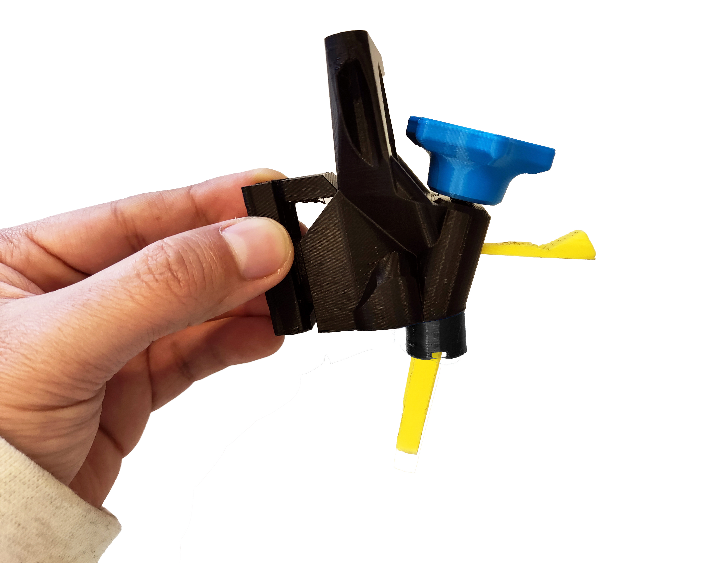

# Assemble the focus mechanism

{{BOM}}

[M3x25mm hex head screw]: parts/mech/HEX-M3-25.md "{cat:mech}"
[M3 washers]: parts/mech/washer.md "{cat:mech}"
[light oil]: parts/consumables/light-oil.md "{cat:consumables, note:'Optional'}"
[M3 nut]: parts/mech/nuts.md "{cat:mech}"
[O-ring]: parts/mech/oring.md "{cat:mech}"
[Nut tool]: models/actuator-assembly-tools.stl "{previewpage}"
[Band tool]: models/actuator-assembly-tools.stl "{previewpage}"
[Thumbwheel]: models/thumbwheel.stl "{previewpage}"
[Focusing assembly]: models/focusing-assembly.stl "{previewpage}"
[Actuator Foot]: models/z_foot.stl "{previewpage}"

## Assemble the thumbwheel {pagestep}

* Push the [M3x25mm hex head screw]{qty:1} into the [thumbwheel][Thumbwheel]{qty:1, cat:printedpart}.
* Thread the [M3 washers]{qty:2} onto the screw.
* Place a drop of [light oil]{qty:1 drop} on the screw thread. You might want to put some kitchen paper or blu roll on your bench to soak up any dribbles of oil.

## Insert the nut {pagestep}

* Push the [M3 nut]{qty:1} into the slot in the [focusing assembly][Focusing assembly]{qty:1, cat:printedpart} (using the [nut insertion tool][Nut tool]{qty:1, cat:printedtool})

## Add the thumbwheel {pagestep}

* Screw the [thumbwheel][Thumbwheel] assembly into the [M3 nut] in the [focusing assembly][Focusing assembly].

## Insert the O ring {pagestep}
* Next, we will insert the [O-ring] to complete the mechanism.

* Thread the [30mm diameter, 2mm thickness Viton O ring][O-ring]{qty:1} through the two holes in the [foot][Actuator Foot]{qty:1, cat:printedpart}, and use the [band insertion tool][Band tool]{qty:1, cat:printedtool} to stretch the two loops of band as shown in the picture.

## Click the band into place {pagestep}

* Line the [foot][Actuator Foot] up with the hole in the bottom of the [focusing assembly][Focusing assembly], and push on the [band insertion tool][Band tool] to click the band into place.
* You should feel two clicks as the two ends of the band hook over the actuator column. It's easier if you use the [nut insertion tool][Nut tool] to hold the mechanism still as you do this.

## Remove the tool {pagestep}

* Gently pull the [band insertion tool][Band tool] out of the [foot][Actuator Foot].
* The band should pull the foot tight against the [focusing assembly][Focusing assembly] as shown.

Well done, you have now assembled the [focusing mechanism]{output, qty:1}.