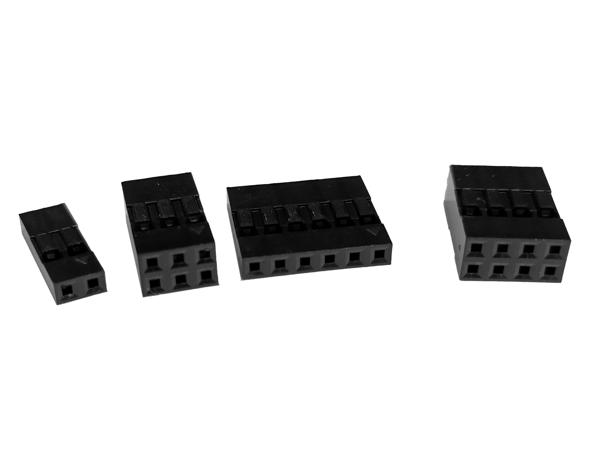

# 2 pin Du Pont Female Housing

Plastic connector designed to hold and secure two male Dupont pins.
It provides a housing for wire connections, allowing for organized and reliable electrical connections.
These housings are commonly used in electronics and prototyping to create secure and structured wiring setups.

_Supplier:_ [Hubot](https://hubot.cl/producto/kit-620-conectores-dupont-254-mm-m-h-sku-425f1/)