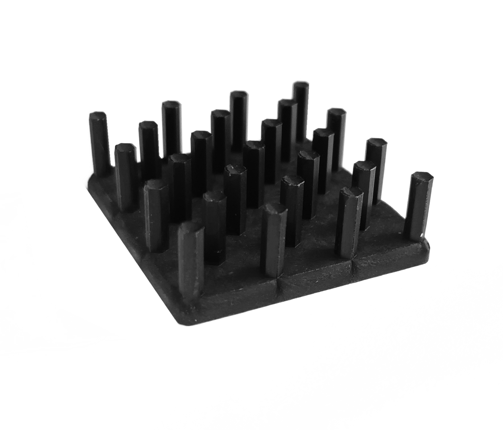

# 30x30x10mm Heat Sink

Passive cooling component used to dissipate heat from electronic devices. Commonly used in computers, LED lights, and other electronic devices to prevent overheating and ensure proper functioning.

_Supplier:_ [Luxeonstar](https://www.luxeonstar.com/30mm-square-14.0-degree-cw-alpha-heat-sink)