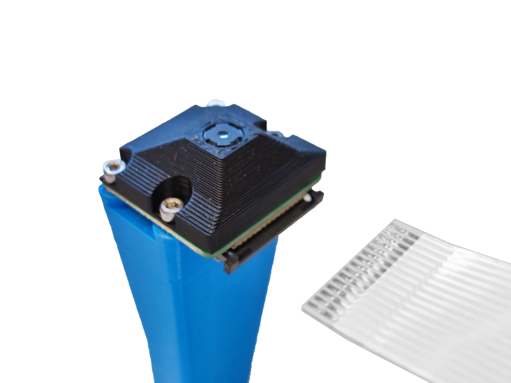
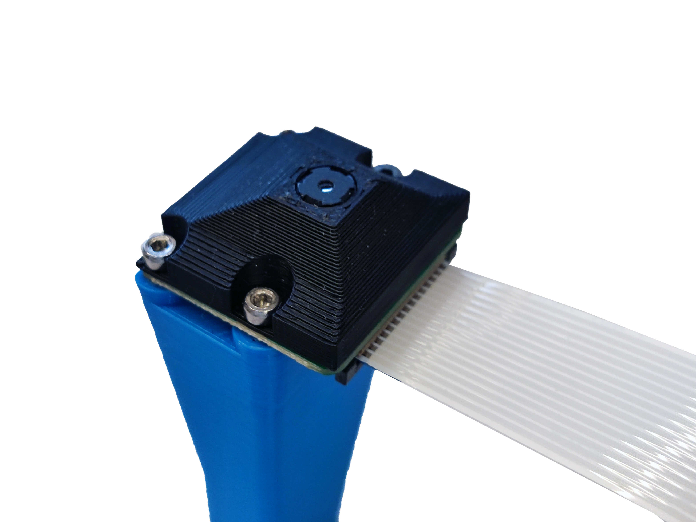

# Raspberry Pi camera ribbon cable

Flat, flexible cable with parallel wires, commonly used for internal device connections. It's prevalent in electronics like computers and printers due to its space-saving design. Ribbon cables enable organized and efficient wiring in tight spaces.

In the [Strobe-enhanced microscopy stage](https://wenzel-lab.github.io/strobe-enhanced-microscopy-stage/) case it connects the raspberry pi and the camera.

_Supplier:_ [MCI electronics](https://mcielectronics.cl/shop/product/cable-flexible-para-camara-o-pantalla-raspberry-pi-610mm-25034/)
