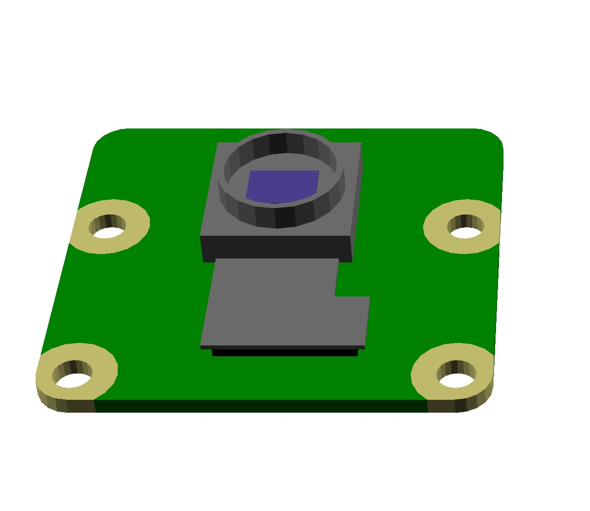

# Raspberry Pi camera V2

Official camera module designed for Raspberry Pi boards.
It features a high-quality image sensor and a lens with adjustable focus.

_Supplier:_ [MCI electronics](https://mcielectronics.cl/shop/product/camara-v2-para-raspberry-pi-raspberry-pi-21481/)