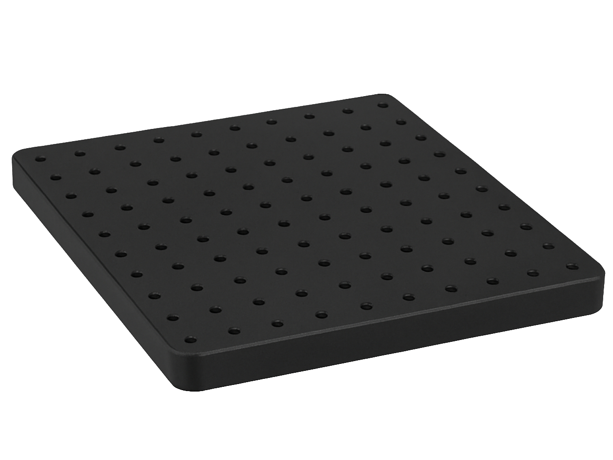

---
PartData:
    Specs:
        Type: Metric
        Length: 300x300mm
        Material: Aluminium
        Supplier:  -[Thorlabs](https://www.thorlabs.com/thorproduct.cfm?partnumber=MB3030/M)
---

# Breadboard

It is a rigid, machined metal platform, which in this case is made of aluminum, that serves as a base for mounting optical, electronic, or mechanical components in experiments, testing setups, or prototyping systems.