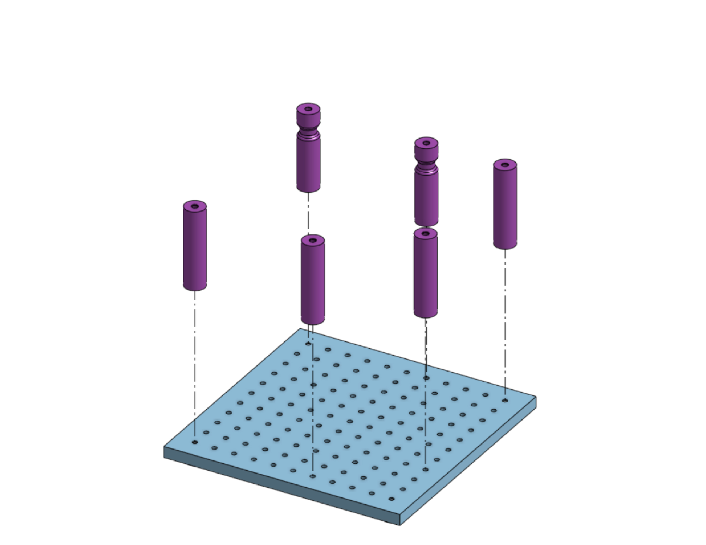
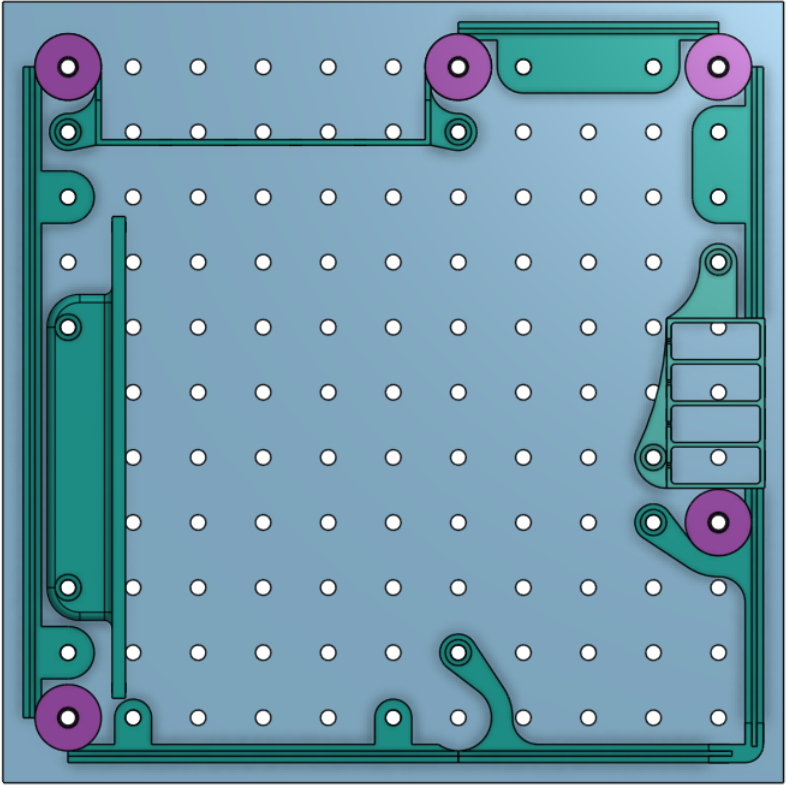
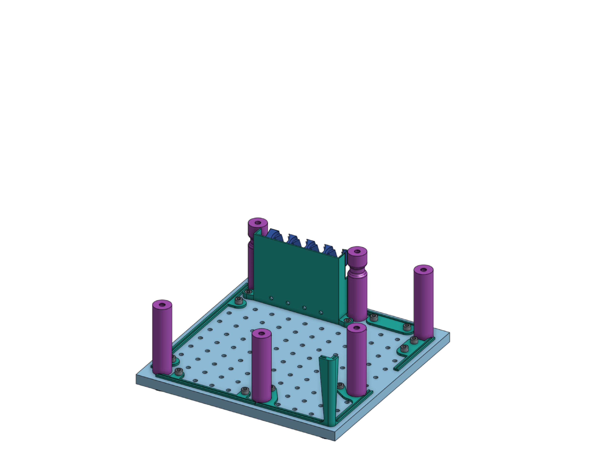
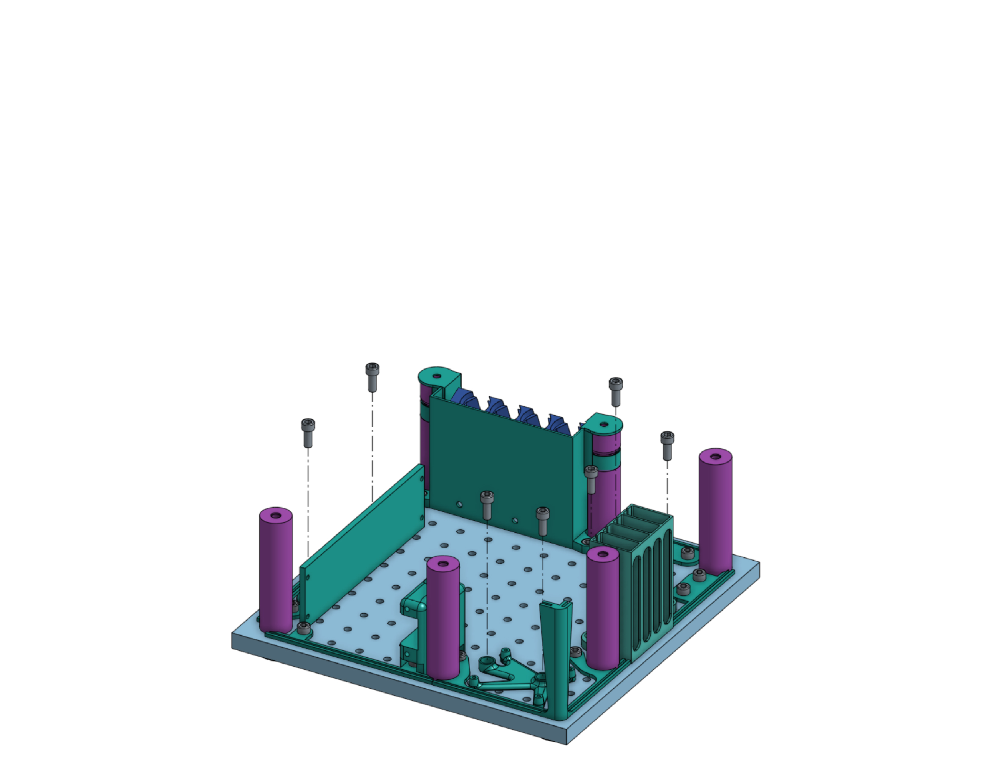
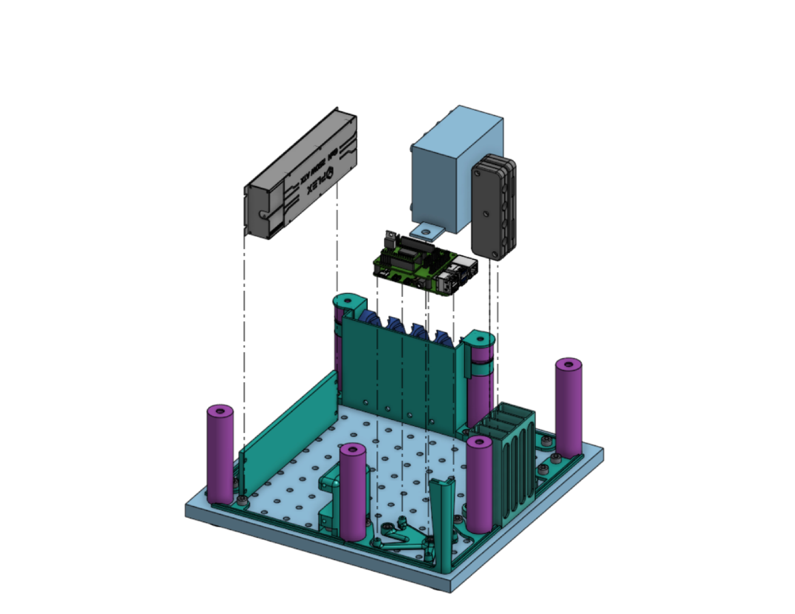
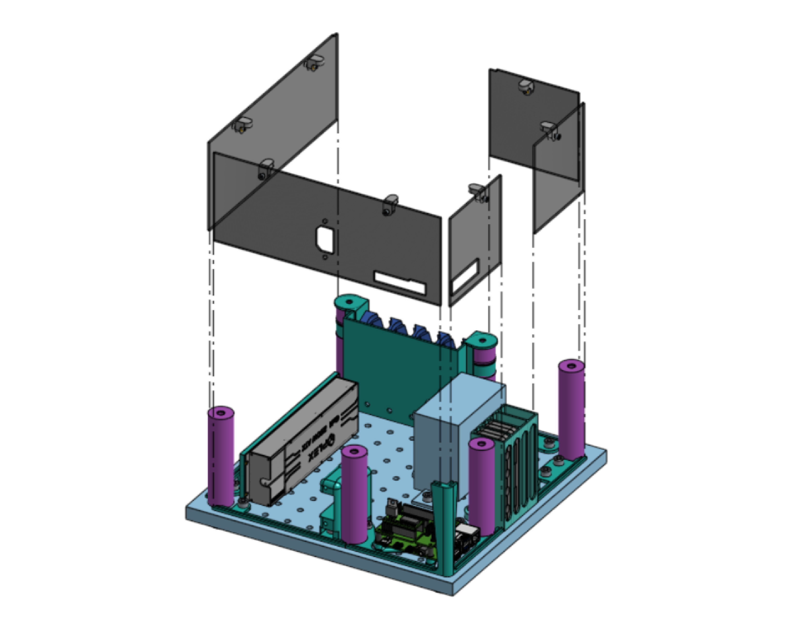
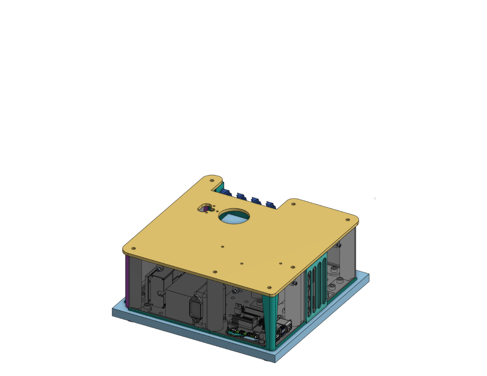

#Assemble the base
{{BOM}}

[M6 x 16mm inner screw]: parts/mech/M6-16i.md "{cat:mech}"
[M3 x 25mm HEX screw]: parts/mech/HEX-M3-25.md "{cat:mech}"
[Nut]: parts/mech/nuts.md "{cat:mech}"
[300x300mm Breadboard]:parts/mech/30x30breadboard.md "{cat:mech}"
[2.5mm Ball-end Allen key]: parts/tools/2.5mmBallEndAllenKey.md "{cat:tool}"

## Put screws into the widget {pagestep}

* Get 6 [M6 x 16mm inner screw]{Qty: 6}s and use them to get the 4 resin-filled legs and the 2 resin-filled thin legs into the 300x300mm [breadboard][300x300mm Breadboard](https://www.thorlabs.com/thorproduct.cfm?partnumber=MB3030/M){Qty:1}

## Put more screws into the widget {pagestep}

* Find thgug
* hgfr

>i **Please Note:** 
>i This site is under construction.
